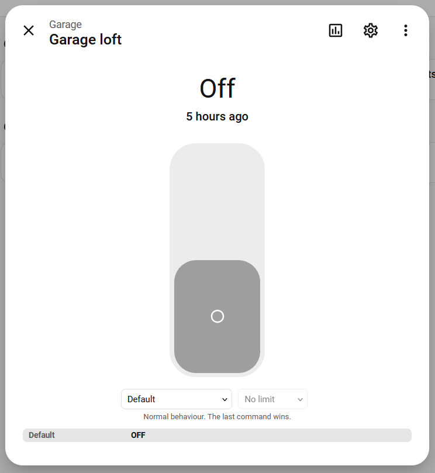
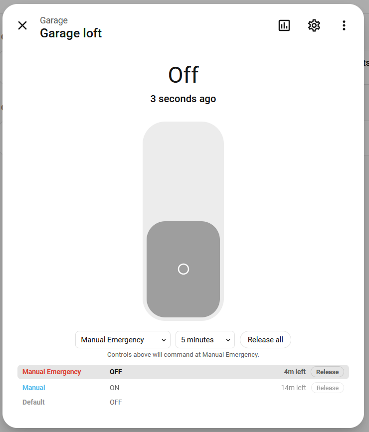
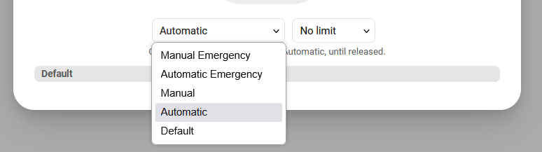
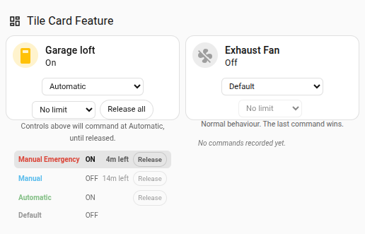
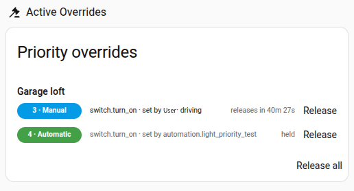
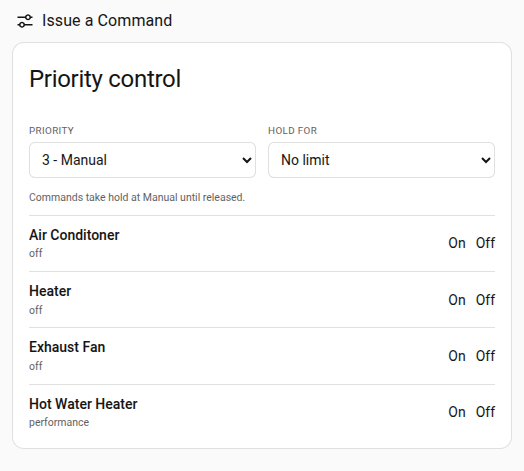

# Priority Command Arbitration for Home Assistant

Give every command a level of authority, so a manual action and an automation can disagree without
one silently clobbering the other.

## The problem

An automation turns the porch light on at dusk. You turn it off, because you are going to bed early.
Twenty minutes later another automation turns it back on. Or the "restore" automation you wrote to
clean up afterwards puts back a state that stopped being true an hour ago.

The usual fixes are an `input_boolean` guard, a scene you capture and restore, or a set of
automations that all know about each other. They work until two of them disagree. If anything
changes while your override is active, the state you captured is already stale by the time you
restore it.

Home Assistant already records **context**: every service call carries who or what triggered it, so
you can trace it afterwards or branch on it in a template. What it has no notion of is
**authority**. Nothing arbitrates between two callers that both want the same entity. Every service
call is a naked write, and the last one wins.

Building automation solved this a long time ago. BACnet gives every commandable point a priority
array: sixteen levels, the lowest-numbered occupied level wins, and writers release their claim when
they are done. This is that idea, trimmed to five levels because sixteen is more than a house needs.

## What it looks like

Open any supported entity. Without any overrides, there is a level picker, a lease picker, and one
row showing that ordinary traffic holds the entity:



With two overrides in place, you can see the whole array and what is queued behind what is winning:



Manual Emergency is driving, so the light is off. Each level carries its own remaining lease and can
be released on its own, or all at once.

The pickers are **modifiers, not buttons**. Choose a level and an optional expiry, then use the
entity's ordinary controls (the toggle, the brightness slider, the cover position handle) and those
commands carry the level you picked. Set a light to 47% at Manual Emergency for half an hour and
that is exactly what gets written.



## The levels

| Level | Name | Who writes here |
|---|---|---|
| 1 | Manual Emergency | You, overriding everything |
| 2 | Automatic Emergency | Life-safety automations (smoke, freeze, water leak) |
| 3 | Manual | You, when you do not want ordinary automations interfering |
| 4 | Automatic | An automation that needs to hold against ordinary traffic |
| 5 | **Default** | **Everything else** |

The lowest-numbered occupied level drives the device. Writes at the same level replace each other.
A command at 3 cannot be overridden by an automation writing at 4, but a smoke alarm writing at 2
still gets through.

When a level is released, control falls to the next occupied level down, and that command is
re-issued **as it stands right now**, not as a snapshot taken when the override began.

## It changes nothing until you ask it to

Everything defaults to level 5, including automations. Since same-level writes replace each other, a
house that never mentions priority behaves exactly as it does today: last command wins, and you can
always countermand an automation from the app (though that automation may fire again and countermand
you).

If you already have `input_boolean` guards, you do not have to remove them to try this. Leave them
in whatever state disables them and they simply stay out of the way.

That default is deliberate. Splitting it (automations at 4, people at 3) is the faithful BACnet
reading, and it is wrong here. Home Assistant automations fire and forget; there is no relinquish
idiom. Level 4 would fill up and never drain, and every entity an automation had ever touched would
go deaf to the UI. Arbitration has to be something you opt into per command, not something that
accumulates behind your back.

## Two worked examples

### Two automations that wanted the same light

On a time-of-use rate plan, a light turns orange during peak hours as a reminder not to start the
oven. That same light is also useful for illumination, so it comes on as a white light in sync with
another light nearby.

Without arbitration, those two automations have to know about each other so they do not fight, and
the coupling gets worse every time a third reason to touch that light appears.

With it, the sync automation fires at Default and the alert automation fires at Automatic. Automatic
outranks Default, so during peak hours the alert wins no matter what the light was doing. At the end
of peak, the alert automation releases its level:

```yaml
# peak starts
- action: light.turn_on
  target: {entity_id: light.kitchen}
  data:
    rgb_color: [255, 140, 0]
    priority: 4          # Automatic

# peak ends
- action: priority.relinquish
  target: {entity_id: light.kitchen}
  data: {priority: 4}
```

On release, control falls to whatever the sync automation currently wants, which is re-issued as it
stands at that moment. Neither automation contains a single line about the other, and each still
does exactly one job.

### An interlock that ordinary automations cannot undo

A well pump should cut out when the energy monitor says it is sucking air, and it should stay out
until a person clears it, even though another automation also commands that relay on its own
schedule.

Writing the cut at Automatic Emergency does that:

```yaml
- action: switch.turn_off
  target: {entity_id: switch.pump}
  data:
    priority: 2          # Automatic Emergency
```

The scheduling automation keeps running and keeps writing at Default. Those writes are recorded, not
dispatched, because level 2 outranks them. The pump stays off until someone calls
`priority.relinquish` on level 2, at which point the schedule takes over again with whatever it
currently wants.

Note that no `priority_ttl` is set here. That is the right call for a safety interlock, and it is
also the case worth being careful about: an indefinite hold stays until something releases it. See
the caveats.

## Temporary overrides

"Turn this light on for twenty minutes, then put it back" has never had a clean answer. The usual
shape is turn on, `delay`, turn off. That breaks if anything else touches the light meanwhile, it
breaks across a restart, and it hardcodes "off" as the thing to return to even when that was never
true.

Give the command a level and a lease instead. Say an automation turns `light.porch` off at 10pm, at
Default, and at 9pm you want it kept on for two hours:

```yaml
action: light.turn_on
target:
  entity_id: light.porch
data:
  brightness_pct: 60
  priority: 3              # Manual
  priority_ttl: "02:00:00"
```

The array now holds:

```
3  Manual    turn_on    2h 0m left    <- driving
5  Default   turn_on
```

At 10pm the automation fires. The light does not turn off. Home Assistant records that something
wants it off at level 5, but level 5 did not win:

```
3  Manual    turn_on    1h 0m left    <- driving
5  Default   turn_off
```

At 11pm the lease expires and level 3 clears. Default is the only occupied level left, so its
command is dispatched and the light goes off:

```
5  Default   turn_off                 <- driving
```

Notice what did not happen: nothing was captured at 9pm and replayed at 11pm. The lease does not
turn the light off, it stops overriding, and Default's command is dispatched as it stands at that
moment. That is why an expiring override lands on Default rather than on the prior state. Had the
automation wanted the light on at 11pm, it would have stayed on, because its command was outranked
the whole time rather than discarded. A lease also survives a restart, which a `delay` does not.

Omit `priority_ttl` (or pass `0`) to hold until something releases it. An override with no end is
easy to issue and easy to forget, and until it is released everything underneath it is dead. It is
rejected at level 5, which has nothing below it to expire back to.

## Physical switches

Now suppose that at 10:30pm, with half an hour still left on that override, you walk over and hit
the switch on the light itself.

Home Assistant sees the state change and knows it did not command it, so it attributes the change to
a person and records it at Default. It does **not** re-send the on command. Your override stays in
the array until it expires or something outranks it, but nothing is re-asserted against you while
Home Assistant is running. The house should not argue with someone standing at a light switch.

Wall switches, vendor apps and Zigbee group commands are all handled this way.

## Using it in YAML

Every arbitrated service takes two extra fields alongside whatever it already accepts:

```yaml
action: cover.set_cover_position
target:
  entity_id: cover.garage
data:
  position: 40
  priority: 3
  priority_ttl: "03:00:00"
```

Both appear as real form fields in the automation editor, the script editor, Developer Tools and
button tap actions, so you get a proper dropdown rather than having to remember the YAML. The
integration rewrites the affected service descriptions at runtime.

## Services

Four services are registered for scripts that need to write, release or inspect an array directly.

### `priority.set`

Writes a level without going through the domain service.

```yaml
action: priority.set
target:
  entity_id: light.porch
data:
  priority: 3
  service: turn_on
  data:
    brightness: 200
  priority_ttl: "00:30:00"     # optional
```

| Field | Required | Notes |
|---|---|---|
| `priority` | yes | 1 to 5 |
| `service` | yes | The bare domain service (`turn_on`, `set_temperature`). The domain comes from the target entity. |
| `data` | no | The payload that service would take |
| `priority_ttl` | no | Duration. Rejected at level 5. |

Both the service and the payload are validated before anything is written, and every target is
validated before any slot is written. A slot that cannot dispatch would still win arbitration and
sit there holding the entity with nothing driving it, which is a silent black hole.

### `priority.relinquish`

Clears one level. If that level was in control, whatever occupies the next level down is re-driven
using its current command.

```yaml
action: priority.relinquish
target:
  entity_id: light.porch
data:
  priority: 1
```

You do not need to re-issue the level below. Releasing 1 when Manual (3) is occupied lands control
on 3 by itself.

### `priority.relinquish_all`

Clears every level above Default.

```yaml
action: priority.relinquish_all
target:
  entity_id: light.porch
```

### `priority.get`

Returns the full array. This is a response service.

```yaml
action: priority.get
target:
  entity_id: light.porch
response_variable: priority_state
```

The response has a single top-level key, `arrays`, keyed by entity id:

```yaml
arrays:
  light.porch:
    entity_id: light.porch
    effective_priority: 1
    effective_priority_name: Manual Emergency
    effective_command:
      domain: light
      service: turn_on
      data: {brightness: 200}
      written_at: "2026-08-14T04:11:07.882Z"
      written_by: <user id or automation entity id>
      expires_at: "2026-08-14T04:41:07.882Z"   # null if no lease
    slots:
      "1": {domain, service, data, written_at, written_by, expires_at}
      "2": null
      "3": null
      "4": null
      "5": {...}
```

Notes that will save you an hour:

- **Slot keys are strings**, `"1"` through `"5"`, not integers.
- The `effective_*` fields are `null` only when *nothing at all* holds the entity, which is not the
  same as Default holding it. An ordinary command lands at 5 and reports as level 5. In practice
  `null` shows up after a restart, for an entity nothing has commanded yet.

So the test for "something is overriding this" is:

```yaml
- condition: template
  value_template: >
    {{ priority_state.arrays['light.porch'].effective_priority not in [5, none] }}
```

and to branch on a specific level:

```yaml
- condition: template
  value_template: >
    {{ priority_state.arrays['light.porch'].effective_priority == 1 }}
```

### A double-click that drops an override

Releasing an emergency hold early and putting something specific underneath it is two calls in a
script, no UI required:

```yaml
- action: priority.relinquish
  target: {entity_id: light.kitchen}
  data: {priority: 1}

- action: priority.set
  target: {entity_id: light.kitchen}
  data:
    priority: 3
    service: turn_on
    data: {brightness: 200}
```

## Dashboard cards

**`custom:priority-feature`** is a tile card feature, not a card. Add it to any tile card and the
same pickers and array appear there:

```yaml
type: tile
entity: switch.garage_loft
features:
  - type: custom:priority-feature
```



This uses a supported frontend extension point, unlike the more-info row, so it is the safest of the
three UI surfaces. The tile on the right has nothing recorded, which is what an untouched entity
looks like.

**`custom:priority-overrides-card`** lists everything currently held, with one-click release:



**`custom:priority-control-card`** issues commands at a level, for a chosen set of entities:



Taking, releasing and expiring an override are all written to the entity's logbook, so the history
shows what held it and when. There is also an `Active overrides` sensor whose state is the number of
levels currently held, with the details in its attributes.

## Supported domains

`light`, `switch`, `fan`, `cover`, `climate`, `water_heater`, `humidifier`, `lock`, `valve`,
`media_player`, `input_boolean`, `input_number`.

Only services that actually command a device are wrapped (`light.turn_on`, `cover.set_cover_position`,
`climate.set_temperature` and so on). Queries and configuration services, and every other domain,
pass through untouched.

## Configuration

Set at install time and changeable afterwards from the integration's **Configure** button.

| Option | Default | What it does |
|---|---|---|
| Scope | All entities | Arbitrate every entity in the supported domains, or only a selected set |
| Excluded entities | none | Never arbitrated, even under `all` |
| Managed entities / areas / labels | none | Under `selected` scope, what to include |
| Default priority for users | 5 | The level a command gets when a person does not name one |
| Default priority for automations | 5 | The same, for automations |
| Track out-of-band changes | on | Record physical switches and vendor apps at Default |

Changing the two default-priority options away from 5 is the one setting that can surprise you, for
the reasons in the section above about why everything defaults to 5.

## Installation

HACS, Custom repositories, add `https://github.com/triosniolin/ha-priority` as an Integration,
install, restart, then add **Priority Command Arbitration** from Settings, Devices & Services. Or
copy `custom_components/priority` into your config directory and restart.

**Hard-refresh your browser afterwards** so the dashboard parts load. The cards register themselves,
so there is no Lovelace resource step.

Home Assistant 2026.8.1 or newer. Not in the HACS default store yet; that needs a brands PR.

## How it works

No fork of Home Assistant is required. For each arbitrated service the integration takes the
`Service` object already in the registry and registers a wrapper under the same name. The wrapper
holds the arbitration decision; the captured original is the only thing that ever touches a device.

Dispatch deliberately does not go back through `hass.services.async_call`. The captured job is
invoked directly, which makes recursion structurally impossible rather than something a guard flag
has to catch, and means one relinquish produces exactly one dispatch.

Changes that do not match any dispatch of ours are attributed to the physical world and recorded at
Default.

## Caveats

Read the first two. They are the ones that could actually cost you something.

### It rewrites the service registry

For every supported service (about fifty of them) this pulls the registered handler out of the live
service registry and registers a wrapper over the same name. That is the central bet, and it rests
on Home Assistant internals rather than public API: `async_services_internal()`, the shape of
`Service`, and the target-resolution helpers.

Those can change in any core release. The code is careful about it (a marker so a reload cannot
double-wrap, a suspend flag so re-registering does not retrigger the registration listener, originals
restored on unload) but careful does not help if core renames something. The realistic bad day is an
upgrade after which supported entities stop responding, fixed by removing the config entry.

Two things reduce that risk rather than just describing it. `tests/test_core_contract.py` asserts
every core internal this depends on, so a break is one obvious failure naming exactly what moved
instead of eighty confusing ones. CI runs that suite weekly against current Home Assistant, so a core
release that breaks it shows up as a red build rather than as your lights going unresponsive.

### A suppressed command reports success

If a level is holding an entity and something lower tries to move it, the command is recorded and not
dispatched. The service call still returns successfully. There is no error to the caller, so a
script, a voice assistant or a dashboard button will all look like they worked.

For a light that is mildly confusing. For `lock` and `valve` it is worth thinking about first: a
forgotten indefinite override on a lock is a genuinely bad failure mode. Either use `priority_ttl` so
overrides expire on their own, or exclude those entities in the options flow. The `Active overrides`
sensor and the overrides card exist to make a forgotten hold visible, but they only help if you look.

### Everything else

- **It is new.** It is in daily production use and has a test suite behind it, but the user base is
  small. Treat it accordingly.
- The more-info row patches a compiled frontend element, because there is no supported way for a
  custom integration to add controls to a built-in card. It is written to fail closed: if a Home
  Assistant update breaks it, the row stops appearing and nothing else changes. The tile card feature
  uses a supported extension point and is the fallback.
- Every override level (1 to 4) is restored across a restart, leases included. A lease that lapsed
  while Home Assistant was down is dropped rather than resurrected. Level 5 is not restored, since it
  is ordinary last-wins traffic and a stored copy of it would be a claim about physical reality that
  may have moved while Home Assistant was down.
- A restored hold at level 1 or 2 is re-issued once, about half a minute after startup finishes.
  Nothing else is. While Home Assistant is running the array is never re-asserted against reality,
  but a restart is the one case that rule does not cover honestly: a change during downtime was
  observed by nobody, so a power blip that dropped a relay looks identical to a person deciding
  something. At the emergency levels that is worth one command; at 3 and 4 it is not, and silently
  re-commanding devices on every boot would be too surprising to do on your behalf. Entities still
  unavailable at that point are skipped and picked up when they return.
- `entity_id: all` is arbitrated. A goodnight scene or an "all off" sweep will not defeat your
  overrides: held entities are skipped, everything else is switched normally. This was not true
  before 2026-08-11, when `all` bypassed arbitration entirely.

## Development

```bash
python -m venv .venv && .venv/bin/pip install -r requirements-test.txt
.venv/bin/python -m pytest tests/     # integration behaviour
node tests/card_test.js               # frontend logic
```

## Licence

Apache 2.0, matching Home Assistant core so the code can be proposed upstream without a relicensing
step.
